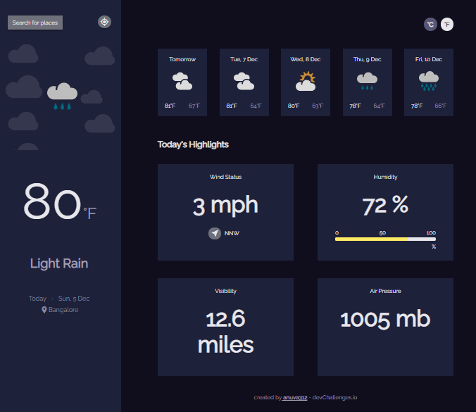
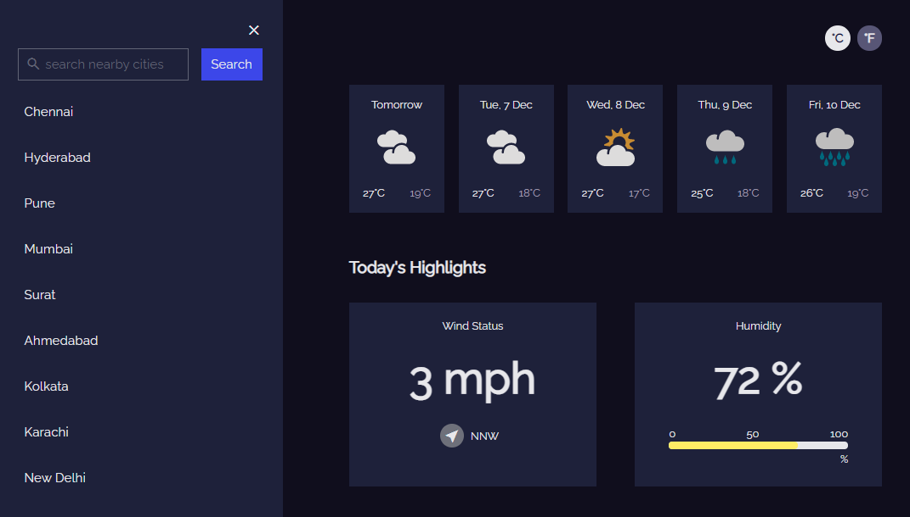
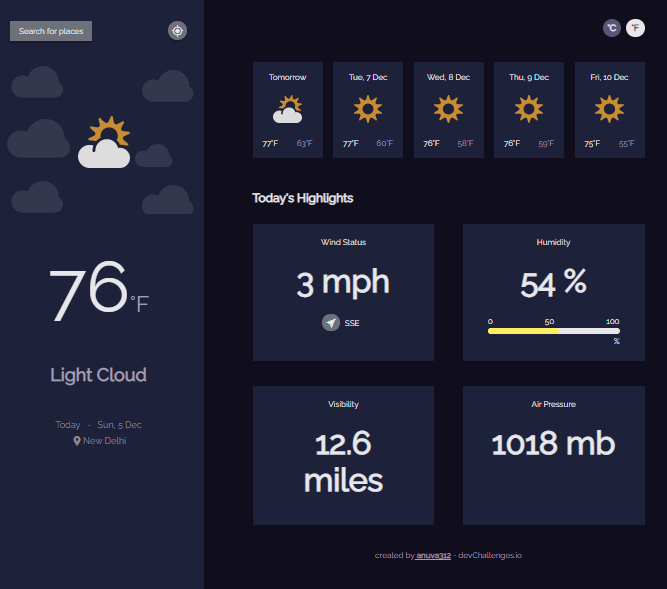
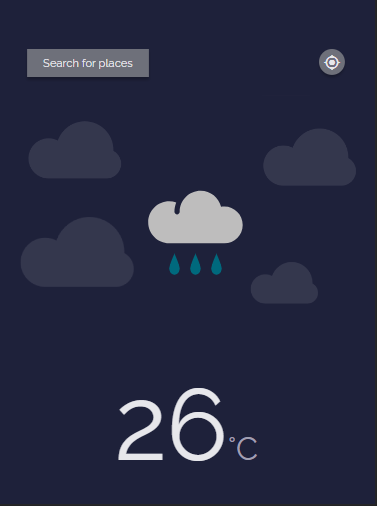
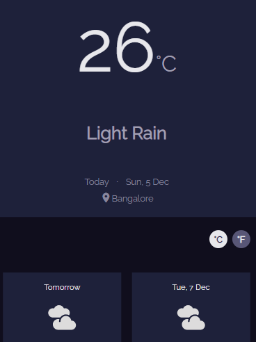
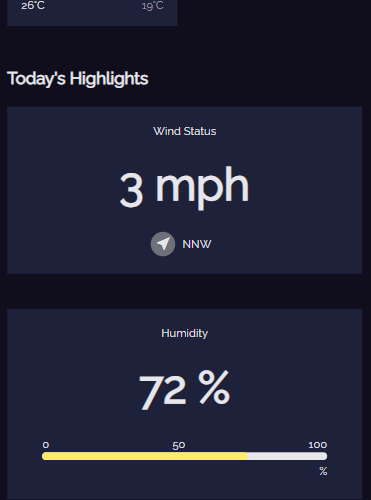

<!-- Challenge -->

## User stories

Fulfill user stories below:

- User story: I can see city weather as default, preferably my current location
- User story: I can search for city
- User story: I can see weather of today and the next 5 days
- User story: I can see the date and location of the weather
- User story: I can see according to image for each type of weather
- User story: I can see the min and max degree each day
- User story: I can see wind status and wind direction
- User story: I can see humidity percentage
- User story: I can see a visibility indicator
- User story: I can see the air pressure number
- User story(optional): I can request my current location weather
- User story(optional): I can convert temperature in Celcius to Fahrenheit and vice versa

<!-- Solution -->

## Solution

#### Main Page

#### Search location

#### Farenheit View

#### Mobile Views

Mobile View Part 1

Mobile View Part 2

Mobile View Part 3

### Built With

- [React](https://reactjs.org/)

<!-- Acknowledgements -->

## Acknowledgements

- [Weather API](https://www.metaweather.com/api/)
- [Loader](https://loading.io/css/)
- [Progress Bar](https://jsfiddle.net/c0481hkp/9/)
